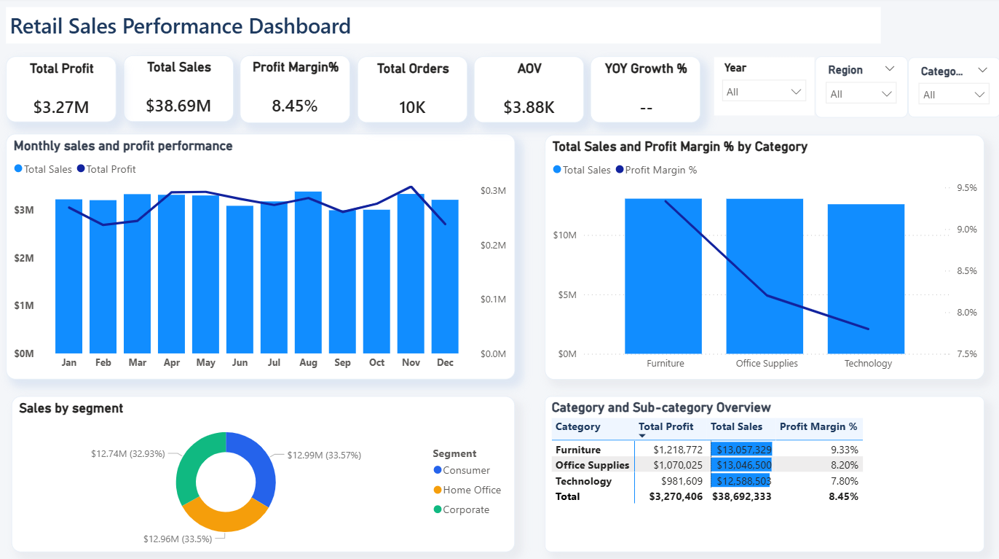
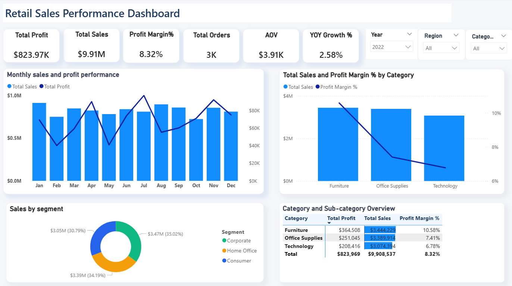

# SQL Data Pipeline & Power BI Dashboard

## Overview
This project shows an end-to-end sales analytics workflow. The raw retail transactions data was cleaned and checked in MySQL, then imported into Power BI to create table relationships, DAX measures, and an interactive dashboard.

**Dataset:** an AI-generated synthetic retail transactions dataset (10,014 rows, 21 columns) with intentionally injected data-quality issues.

## Aim
The main aim of this project was to analyze sales performance and profitability (Sales, Profit, and Profit Margin) across different months, categories, segments, and sub-categories, along with overall business metrics like Total Orders, AOV, and YoY Growth %. The goal was to identify important patterns and differences in sales and profitability, and present the findings through an interactive Power BI dashboard.

## Tools Used
MySQL
Power BI (Power Query + DAX)

## Step 1: Database Setup
Created a new database (sales) and loaded the raw retail transactions data into it as the retail_sales table.

## Step 2: Data Understanding
Checked total row count and distinct Row_id count to confirm the raw data size before touching anything.
Checked which rows had missing or blank values in the key columns (Order ID, Order Date, Sales, Profit, Region, Segment, Category) before deciding a cleaning plan.

## Step 3: Duplicate Check (Initial)
Grouped by every column (except Row_id) and used HAVING COUNT(*) > 1 to see if any fully duplicate rows existed before cleaning started.

## Step 4: Data Cleaning

**Missing Values**

Counted blank/invalid values first in Sales, Profit, Order Date, and City.
Sales: blank values ("") converted to NULL.
Profit: blank, "unknown", and "N/A" values all converted to NULL.
Order Date: "N/A" text values converted to NULL.
City: blank values converted to NULL.
Decision: NULL was used instead of deleting rows, because SUM()/AVG() in SQL automatically skip NULL values, so the row's other data (Region, Category, etc.) doesn't get lost.

**Removing Unwanted Symbols**

Found a "?" symbol before some Sales values and removed it using REPLACE() before converting the values to numbers.

**Data Type Conversion**

Sales and Profit converted to DECIMAL(10,2).
Quantity converted to INT.
Discount converted to DECIMAL(3,2).

**Text Standardization**

Fixed spelling mistakes in Sub-Category (example: "Accessoriess" → "Accessories", "Bookcasess" → "Bookcases", "Furnishingss" → "Furnishings", "Machiness" → "Machines", "Storagee" → "Storage", "Appliancess" → "Appliances").
City column had State name attached in a "City, State" format. Split it using SUBSTRING_INDEX() to keep only the City name.

**Duplicate Removal (Final)**

Used ROW_NUMBER() with PARTITION BY across all columns except Row_id (Row_id is unique for every row) to identify duplicate rows, then deleted the extra copies (kept the first occurrence, rn = 1), verified afterward with a SELECT COUNT(*) check.

## Step 5: Business Validation
Negative Sales: Rows with Sales below 0 were removed because the dataset has no Refund or Return column to explain these values.
Invalid Discount: Rows where Discount was less than 0 or greater than 1 (not a valid percentage). Only the Discount value was set to NULL, the row itself was kept.
Negative Quantity: Fixed using ABS() to convert negative values to positive, treated as a sign-entry mistake rather than deleting the row.
Verified each fix afterward with SELECT COUNT(*) checks to confirm no invalid values remained.

**Result:** 10,014 raw rows became 9,986 clean rows (20 duplicate rows and 8 negative Sales rows removed).

## Step 6: Business SQL Queries
Wrote SQL queries to calculate the main business metrics before building the dashboard, and used them as a reference for the Power BI numbers:

Total Sales, Total Profit, Profit Margin % (Profit / Sales × 100)
Total Orders (distinct Order ID count)
Average Order Value (AOV = Total Sales / Total Orders)
Year-over-Year Growth % (using LAG() window function to compare each year's sales to the previous year)
Monthly Sales and Profit trend
Sales and Profit Margin % by Category
Sales by Segment
Category + Sub-Category level Sales, Profit, and Profit Margin overview

The monthly Sales and Profit results matched the Power BI monthly chart.

## Step 7: Power Query
Connected Power BI to MySQL using Get Data, and imported the cleaned retail_sales table.
Power Query was used only for light data preparation, since all major data cleaning and business logic were already handled in SQL:

Orders: kept only the columns needed for the fact table (including Region, Segment and Sub_category), changed Order_date and Ship_date to Date type, trimmed and cleaned the text columns, and capitalized each word in Region.
Product: kept only Category and Sub_category, trimmed and cleaned the text, and removed duplicates (17 rows).
Customer: kept only Segment, trimmed and cleaned the text, and removed duplicates (3 rows).
Location: kept only Region, capitalized each word, and removed duplicates (4 rows).

**Why the dimension tables are not built on Product_id and Customer_id:** while checking the model, I found that these ID columns are not unique to one category or segment (for example, the same Product_id appears under more than one Category, and the same Customer_id appears under all three Segments). Removing duplicates on the ID column assigned the wrong Category and Segment to many rows. So the dimension tables were rebuilt using the columns the charts actually need (Category + Sub_category, and Segment), which gives one clean row per value.

## Step 8: Power BI Data Model
After Close & Apply, built a star schema: one fact table (Orders), three dimension tables (Product, Customer, Location), and a separate Date table connected to Orders.

| From (Orders) | To | Type |
|---|---|---|
| Sub_category | Product[Sub_category] | Many-to-one, single direction |
| Segment | Customer[Segment] | Many-to-one, single direction |
| Region | Location[Region] | Many-to-one, single direction |
| Order_date | Data Table[Date] | Many-to-one, single direction |

Created the Date table ('Data Table') using CALENDARAUTO(), with Year, Month Number, Month Name and Quarter columns.
Removed duplicate records from the dimension tables so that each relationship is many-to-one and avoids a many-to-many relationship issue with the fact table.
Product_id and Customer_id stay in the Orders table for reference, but they are not used for relationships.

## Step 9: DAX Measures
Total Sales
Total Profit
Profit Margin %: uses DIVIDE() to avoid divide-by-zero errors.
Total Orders: DISTINCTCOUNT() on Order ID.
Average Order Value (AOV): Total Sales divided by Total Orders, using DIVIDE().
Year-over-Year (YoY) Growth %: compares Total Sales with the same period last year using SAMEPERIODLASTYEAR() and SELECTEDVALUE() on the Year column. It shows a value only when exactly one year is selected in the Year slicer, and stays blank when "All" years are selected, so it never shows a misleading number.

## Step 10: Dashboard

*All years selected. YoY Growth % stays blank because it needs a single year.*

*Year 2022 selected. YoY Growth % shows 2.58%.*

**Page 1: Overview**

Slicers: Category, Region, Year
KPI Cards: Total Sales, Total Profit, Profit Margin %, Total Orders, AOV, YoY Growth %
Monthly Sales and Profit chart (Sales as columns, Profit as a line on a secondary axis starting from 0)
Category + Sub-Category pivot table (Sales, Profit, Profit Margin %)
Sales by Segment donut chart
Category-wise Sales and Profit Margin combo chart

**Page 2: Chart-wise Insights**

Each chart from Page 1 is explained using Pattern, Reason, and Suggestion. Pattern is what the chart shows, Reason is what in the chart's data supports it, and Suggestion is a simple next step. Monthly numbers are all years (2019-2022) combined.

1. Monthly Sales and Profit Performance
* Pattern: Sales range from $3.00M to $3.40M. August has the highest sales ($3.40M), September the lowest ($3.00M), and November the highest profit ($307K).
* Reason: The chart shows August had more orders (908) than September (760), which may explain its higher sales.
* Suggestion: Try simple offers in September, where sales are lowest, to see if they help increase sales.

2. Total Sales and Profit Margin % by Category
* Pattern: Sales range from about $12.6M to $13.1M across the three categories. Furniture has the highest margin (9.33%), while Technology has the lowest (7.80%).
* Reason: Machines (a Technology sub-category) has a low margin of 6.04%, which may contribute to Technology's lower margin.
* Suggestion: Check the prices and costs of Machines to see if there is a way to improve its profit.

3. Sales by Segment
* Pattern: Sales are nearly equal across Consumer (33.57%), Home Office (33.50%), and Corporate (32.93%).
* Reason: The chart shows the gap between the highest and lowest segment is only about $0.25M.
* Suggestion: Sales are almost equal across all three segments, but you could try simple ways to increase Corporate sales.

4. Category and Sub-category Overview
* Pattern: Furniture has the highest profit ($1.22M), and Bookcases has the highest sub-category profit ($384K). Labels and Machines have the lowest margins.
* Reason: The chart shows Bookcases had the highest sub-category profit ($384K) with a 10.79% margin, while Labels (5.90%) and Machines (6.04%) had the lowest margins.
* Suggestion: Give more attention to Bookcases and Tables, and check why Labels and Machines have lower profit margins.

**Page 3: Key Findings and Business Recommendations**

Key Findings
* Total Sales are $38.69M and Total Profit is $3.27M, giving an overall Profit Margin of 8.45%.
* Sales remain fairly steady across months, but Profit Margin falls to around 7.3% in February, March, and December.
* Furniture has the highest Profit Margin (9.33%), while Technology has the lowest (7.80%).
* Sales are evenly split across the three segments.

Business Recommendations
* Focus on strong Furniture sub-categories, especially Bookcases and Tables.
* Review pricing, costs, and discounts for Machines and Labels, where margins are low.
* Check September and October sales to identify opportunities to increase orders.
* Investigate why Profit Margin is lower in February, March, and December.

## Data Notes
* **Missing order dates:** 22 transactions have no Order Date ("N/A" in the raw data). They stay in the data, but they have no date to match on the Date table, so they drop out of the dashboard when the Year filter (2019-2022) is applied. This is why the dashboard Total Sales ($38.69M) is slightly lower than the SQL total ($38.78M).
* **AOV difference:** SQL AOV is $3,901.05 and the dashboard AOV is $3,883.21. The SQL query leaves out orders with NULL Sales when counting orders, while the Power BI measure counts every distinct Order ID.

## Project Workflow
Raw Dataset → MySQL Data Cleaning → Business Validation → Power BI Data Model → DAX Measures → Interactive Dashboard with Business Insights
